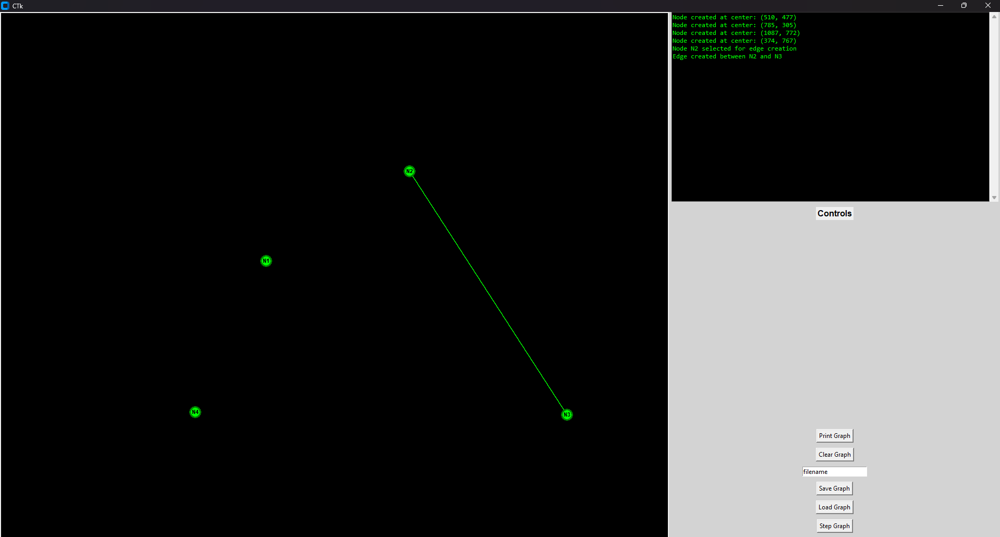
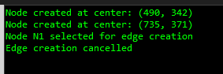
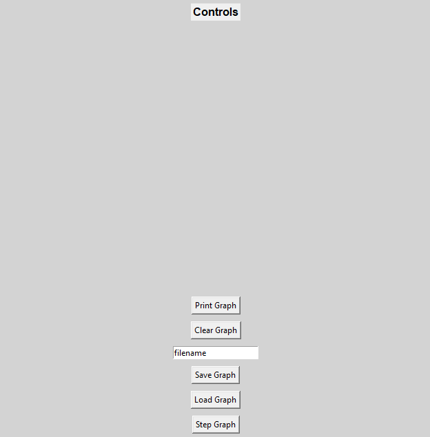
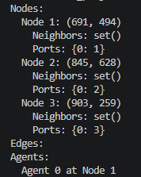

# Dispersion-is-Almost-Optimal-under-A-synchrony

## Projekt
A projekt a [Dispersion-is-Almost-Optimal-under-A-synchrony](https://dl.acm.org/doi/pdf/10.1145/3694906.3743317) tanulmányhoz tartozó demonstrátor program.

## Használat
A program terminálból a ```python main.py``` paranccsal futtatható. A megjelenő ablakon bal oldalt látható az algoritmushoz tartozó gráf. 
### Gráf ablak
A gráf ablakban:
- Bal klikkel létrehozható új csúcspont
- Bal klikkel összeköthető két meglévő csúcspont egy éllel
- Jobb klikkel egy meglévő csúcspontra egy agent helyezhető

### Log ablak
Jobb oldalt fent egy egyszerűsített log látható, ami nyomon követi a gráf létrehozását, és visszajelzést ad a kattintásokról a gráf ablakban.

Például, ha meghiúsul az él létrehozása, mert a második kattintás nem egy csúcson történt, azt a program itt jelzi.

### Vezérlőgombok

#### Print Graph
A fejlesztőkörnyezet termináljába írja ki a gráfunkat.

#### Clear Graph
Kitörli a jelenlegi gráfot.
#### Save/Load Graph
A szöveges input néven elmenti a gráfot a ```graphs``` mappába, vagy a szöveges input nevű elmentett gráfot betölti a ```graphs``` mappából. Minden gráf JSON kiterjesztésben van elmentve, de nem kell kiterjesztést írni a szöveges inputba, csak fáljnevet.
#### Step Graph
Minden agentet léptet a definiált logika alapján.

## Algoritmus
TODO
Az algoritmus leírásához csak a ```graph.py``` file ```step_graph(self)``` függvényében kell a logikát leírni. A függvény végigmegy az agenteken, és mindet elmozgatja az aktuális node egy portján. Ehhez a ```graph.py``` file ```move_agent(self, agent, port_number)``` függvényét célszerű használni. Az agentnek van saját move függvénye, de a ```graph.py``` move függvénye automatikusan helyesen használja azt, és az agent a feladatban csak portokat lát, szóval ennek elégnek kéne lennie. Ha az agent nem mozog, akkor el lehet mozdítani a 0-ás porton, mert minden node 0-ás portja önmagára mutat.